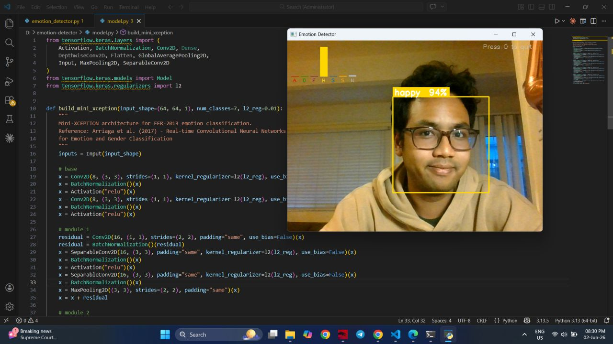
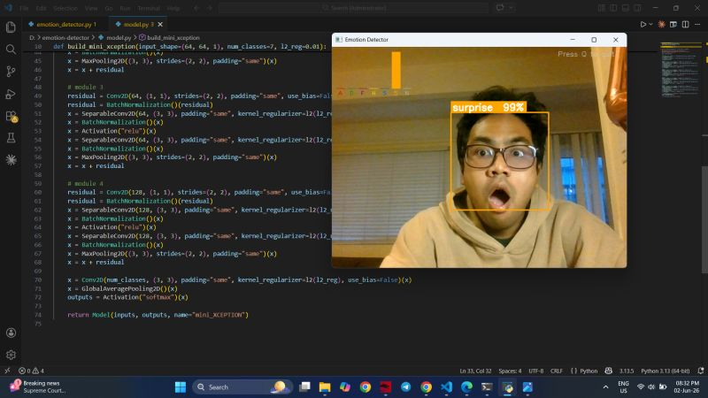

# 🎭 Real-Time Facial Emotion Detector

<p align="center">
  <a href="https://www.python.org/"></a>
  <a href="https://opencv.org/"></a>
  <a href="https://www.tensorflow.org/"></a>
  <a href="https://arxiv.org/abs/1710.07557"></a>
  <a href="https://www.kaggle.com/c/challenges-in-representation-learning-facial-expression-recognition-challenge"></a>
  <a href="https://www.linkedin.com/posts/kyaw-soe-lwin-687643314_datascience-machinelearning-deeplearning-activity-7467782287544467456-QmTY"></a>
</p>

A real-time facial expression and emotion recognition pipeline operating directly on live webcam feeds. Powered by OpenCV Haar Cascade face localization and a lightweight **mini-XCEPTION** Convolutional Neural Network pretrained on the FER-2013 benchmark dataset.

---

## 📸 Live Demo Showcase

Visitors and recruiters can see the real-time detection in action below without needing to clone or run code locally:

### 1. Single Face Emotion Classification with Live Probability HUD
Real-time face tracking with confidence estimation and a dynamic probability distribution bar chart overlay.

<p align="center">
  
</p>

### 2. Multi-Face Simultaneous Emotion Tracking
Robust multi-subject localization classifying disparate emotions simultaneously in real time (collaborative testing with May Thet Nwe Tun).

<p align="center">
  
</p>

### 3. Dynamic Emotional Transition Analysis
Instantaneous sensitivity capturing rapid emotional shifts and facial micro-expressions.

<p align="center">
  
</p>

---

## ⚡ Real-Time Inference Pipeline

The system executes a seamless, modular 5-stage inference pipeline at 30+ FPS:

```
[Webcam Stream] 
       │
       ▼
 1. Frame Acquisition (cv2.VideoCapture)
       │
       ▼
 2. Face Localization (OpenCV Haar Cascade Classifier)
       │
       ▼
 3. Preprocessing (Grayscale ROI → 64×64 Resize → [-1, 1] Normalization)
       │
       ▼
 4. Mini-XCEPTION Inference (Depthwise Separable Convolutions + Residuals)
       │
       ▼
 5. Live Probability HUD & Overlay (Color-coded Bounding Boxes & Bar Chart)
```

1. **Frame Acquisition (`cv2.VideoCapture`)**: Continuously ingests camera frames with minimal latency.
2. **Face Localization (`haarcascade_frontalface_default.xml`)**: Rapidly detects one or more face regions of interest (ROI) per frame.
3. **Preprocessing (`model.py` / `emotion_detector.py`)**:
   - Converts the color frame to grayscale.
   - Extracts the bounding box with margin padding.
   - Resizes ROI to the required 64x64 model input resolution.
   - Normalizes pixel values to [-1.0, 1.0].
4. **Mini-XCEPTION Deep CNN Inference**:
   - Depthwise separable convolutions significantly reduce parameter count while maintaining feature representation.
   - Residual shortcut connections prevent gradient degradation.
   - Global Average Pooling replaces parameter-dense fully connected layers.
   - Outputs a 7-dimensional softmax distribution over: **Angry, Disgust, Fear, Happy, Sad, Surprise, Neutral**.
5. **Live Probability HUD & Bar Chart Overlay**:
   - Renders colored bounding boxes and top emotion label over detected faces.
   - Renders a real-time side-car bar chart illustrating the live confidence level for all 7 emotions.

---

## 📂 Project Structure

```bash
emotion-detector/
├── assets/
│   ├── demo_happy.png         # Demo: Single face emotion + HUD bar chart
│   ├── demo_multi_face.png    # Demo: Multi-face concurrent detection
│   └── demo_surprise.png      # Demo: Dynamic surprise expression
├── model.py                   # Mini-XCEPTION architecture definition
├── emotion_detector.py        # Main real-time webcam inference script
├── download_model.py          # Pretrained weights downloader (~26MB)
├── requirements.txt           # Python dependencies
└── README.md                  # Project documentation & demo showcase
```

---

## 🚀 Quick Start

### 1. Clone the Repository
```bash
git clone https://github.com/CapMorningStar/emotion-detector.git
cd emotion-detector
```

### 2. Install Dependencies
```bash
pip install -r requirements.txt
```

### 3. Download Pretrained Weights (~26MB)
```bash
python download_model.py
```

### 4. Run Real-Time Detection
```bash
python emotion_detector.py
```

*Tip: If using an external USB webcam, supply the camera index:*
```bash
python emotion_detector.py 1
```
*Press **Q** to exit the application window.*

---

## 🧠 Model Architecture & Background

- **Input Dimension**: 64 x 64 x 1 grayscale image
- **Output**: 7 softmax emotion probabilities
- **Design Highlights**: Mini-XCEPTION utilizes depthwise separable convolutions and residual modules to achieve ~66% test accuracy on FER-2013 while remaining lightweight enough for CPU/low-power edge real-time video processing.
- **Reference**: [Arriaga et al. (2017) - Real-time Convolutional Neural Networks for Emotion and Gender Classification](https://arxiv.org/abs/1710.07557)
- **Pretrained Weights**: Sourced from [oarriaga/face_classification](https://github.com/oarriaga/face_classification).

---

## 🙏 Acknowledgments

- Built after studying Convolutional Neural Networks (CNNs) from **Andrew Ng's Deep Learning Specialization**.
- Special thanks to **May Thet Nwe Tun** for assisting with multi-face detection testing.
- View the project announcement and discussion on [LinkedIn](https://www.linkedin.com/posts/kyaw-soe-lwin-687643314_datascience-machinelearning-deeplearning-activity-7467782287544467456-QmTY).
